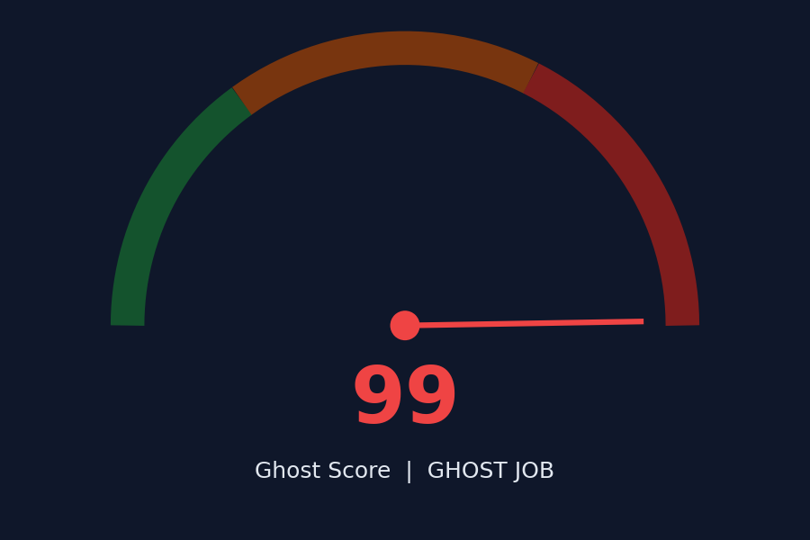
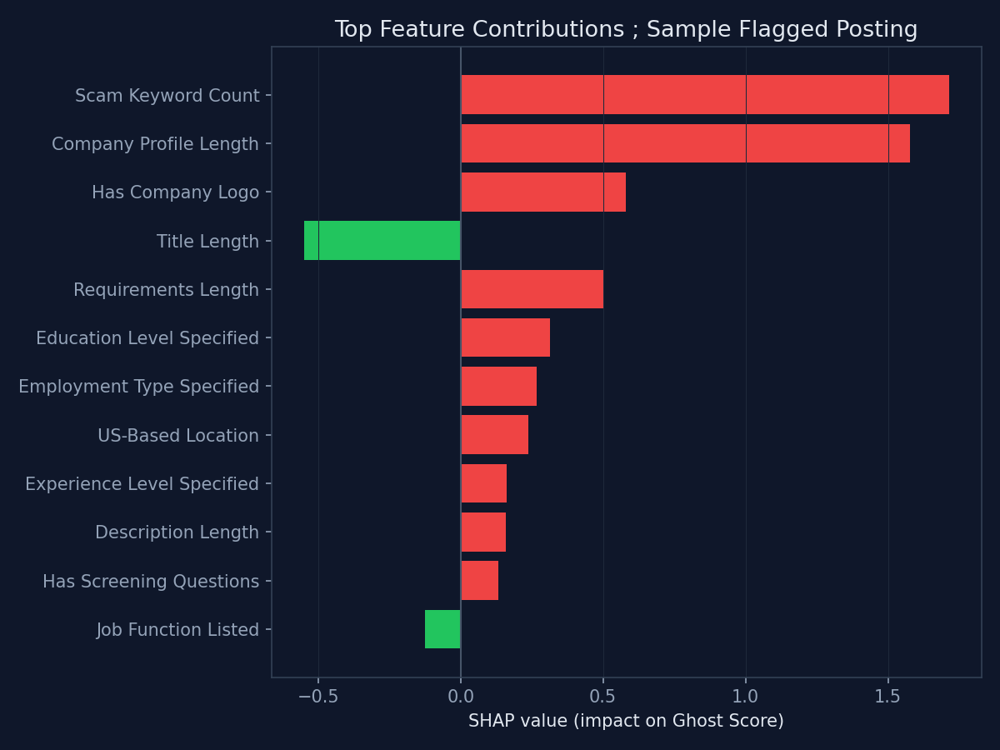
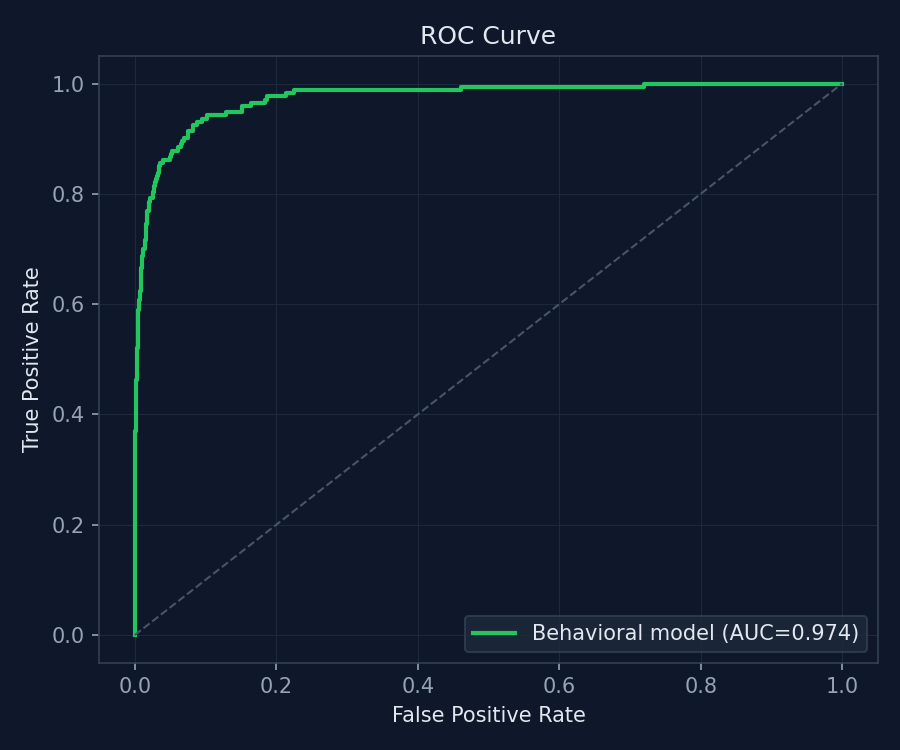
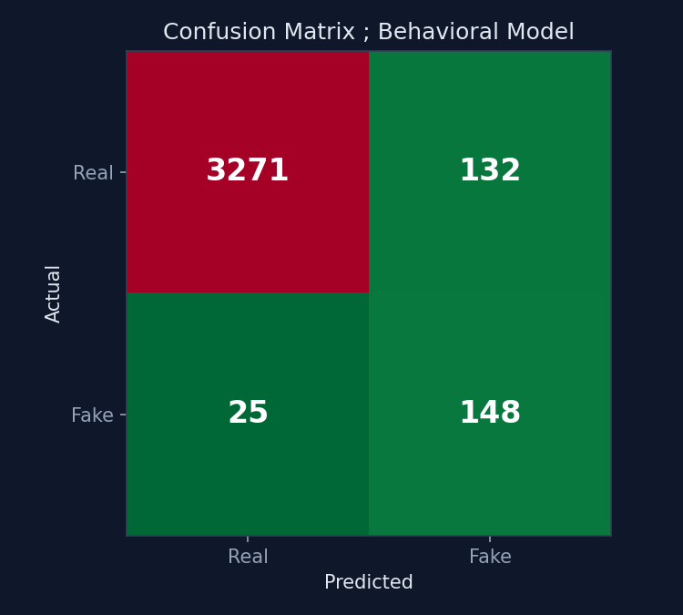
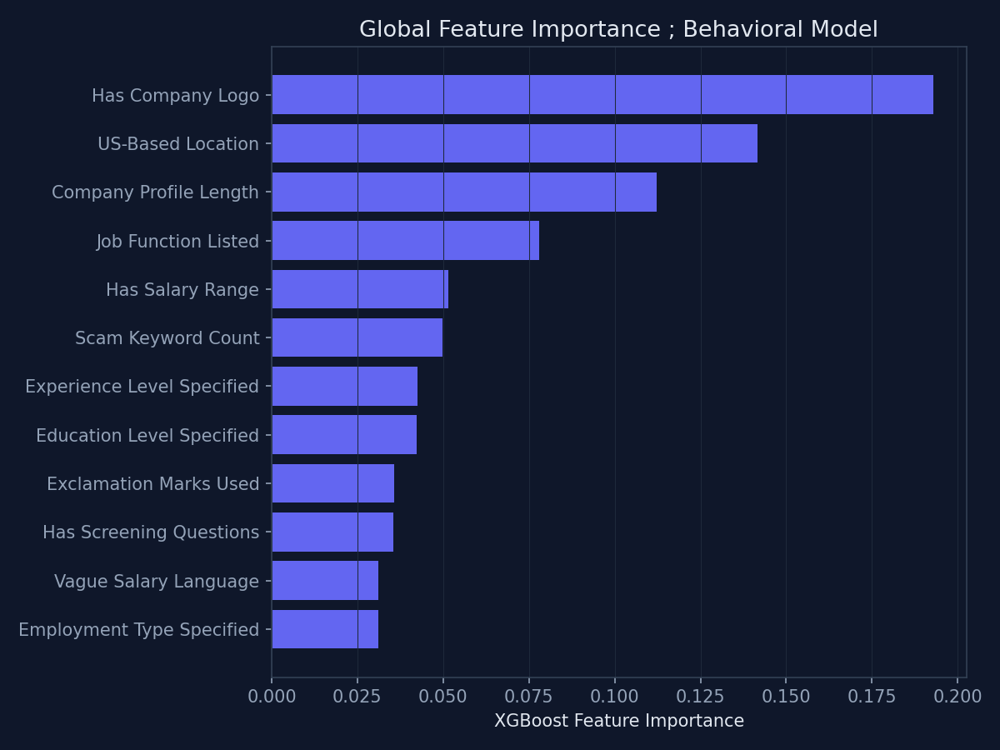

# GhostHunt — Fake Job Posting Detector

[](https://colab.research.google.com/github/Aayushx9/GhostHunt-fake-job-detector/blob/main/GhostHunt%20-%20Fake%20Job%20Detector.ipynb)
[](https://python.org)
[](https://xgboost.readthedocs.io)
[](https://github.com/Aayushx9/GhostHunt-fake-job-detector/blob/main/LICENSE)

**Author:** Aayush Bharadwaj · [github.com/Aayushx9](https://github.com/Aayushx9)
**MS Data Science · University of Colorado Boulder**

> Detects ghost and scam job postings from behavioral signals and posting text. Trained on the 17,880-posting EMSCAD corpus, it scores any listing 0–100, explains the score with SHAP, and ships as a two-tab Gradio app — paste a raw posting or fill in structured fields.

---

## Dashboard Preview

[](assets/GhostScore_Gauge.png)

A posting scored 99/100 — flagged **GHOST JOB**. Every score comes with the SHAP breakdown that produced it:

[](assets/SHAP_Waterfall.png)

---

## What It Does

GhostHunt looks at a job posting the way a skeptical applicant would — not just the words, but the structure. Is there a real salary range? A company logo? Screening questions? Combined with red-flag language in the text itself (urgency, vague pay, scam-adjacent phrasing), it scores every posting on a 0–100 Ghost Score and tells you exactly which signals pushed it there.

**One-liner:**
*"I built a fake job posting detector on the 17,880-listing EMSCAD corpus, combining 20 behavioral/structural signals with TF-IDF text features in XGBoost, then trained a second lightweight model on the behavioral features alone so every prediction gets a clean SHAP explanation — deployed as an interactive Gradio scorer."*

---

## Dataset

[#dataset](#dataset)

**EMSCAD** (Employment Scam Aegean Corpus) — 17,880 real-world job postings, each labeled real or fraudulent.

```
Total postings   : 17,880
Fraudulent       : 866   (4.8%)
Real              : 17,014  (95.2%)
```

A ~5% fraud rate is a realistic, heavily imbalanced problem — most of the design decisions below (scale_pos_weight, a separate behavioral model, threshold-aware evaluation) exist because of it.

---

## Pipeline Architecture

```
Raw postings (17,880)
        │
        ├── Behavioral / structural features (20)  ──┐
        │   has_salary · has_logo · scam_keyword_count │
        │   desc_len · exclamation_count · is_us · …   │
        │                                              ├──► XGBoost (320-dim) ──► Full Ghost Score model
        └── TF-IDF on posting text (top 300, 1–2 grams)┘
                                                          
        Behavioral features alone (20) ──► XGBoost (20-dim) ──► SHAP explainer ──► Gradio scorer
```

| Section | Step                        | Description                                                    |
| ------- | --------------------------- | ---------------------------------------------------------------|
| 1       | Setup                       | Install dependencies, imports                                  |
| 2       | Data                        | Download EMSCAD dataset                                        |
| 3       | Inspection                  | Load, check shape and class balance                            |
| 4       | Feature engineering         | 20 behavioral/structural signals extracted from raw fields     |
| 5       | Text vectorization          | TF-IDF (300 terms, 1–2 grams) stacked with behavioral features |
| 6       | Full model                  | XGBoost on the combined 320-dim matrix                         |
| 7       | Behavioral model + SHAP     | A second, lightweight model trained for explainability         |
| 8       | Prediction helpers          | Parse raw text or structured fields into a feature row         |
| 9       | Chart builders               | Gauge, SHAP waterfall, feature scorecard                       |
| 10      | Gradio UI                   | Two-tab interactive scorer                                     |

**Why two models?** SHAP on 320 sparse TF-IDF dimensions produces unreadable charts. A second XGBoost model trained on just the 20 behavioral features gives up a little raw signal but makes every explanation legible — a deliberate accuracy/interpretability trade-off.

---

## Feature Engineering

[#feature-engineering](#feature-engineering)

20 behavioral and structural signals, independent of the free-text content:

| Category      | Features                                                                                  |
| -------------- | ------------------------------------------------------------------------------------------ |
| Posting completeness | `has_salary`, `has_company_logo`, `has_questions`, `has_function`, `has_industry`   |
| Classification fields | `employment_type_enc`, `experience_enc`, `education_enc`, `telecommuting`         |
| Text shape     | `desc_len`, `title_len`, `profile_len`, `requirements_len`                                |
| Red-flag language | `scam_keyword_count`, `vague_salary`, `exclamation_count`, `caps_word_count`           |
| Contact / structure | `has_email_in_desc`, `url_count`, `is_us`                                           |

`scam_keyword_count` matches phrases like *"unlimited earning"*, *"be your own boss"*, and *"no experience needed"* against the combined posting text.

---

## Model Training & Validation

[#model-training--validation](#model-training--validation)

Both models use XGBoost with `scale_pos_weight ≈ 19.6` to correct for the 4.8% fraud rate, on an 80/20 stratified split.

### ROC Curve — Behavioral Model

[](assets/ROC_Curve.png)

### Confusion Matrix — Behavioral Model

[](assets/Confusion_Matrix.png)

```
              precision    recall  f1-score   support

        Real       0.99      0.96      0.98      3403
        Fake       0.53      0.86      0.65       173

    accuracy                           0.96      3576
```

The model is tuned to catch fraud (86% recall on the Fake class) at the cost of some false positives — the right trade-off for a screening tool where a missed scam is worse than an extra human review.

---

## Explainability — SHAP & Feature Importance

[#explainability--shap--feature-importance](#explainability--shap--feature-importance)

### Global Feature Importance

[](assets/Feature_Importance.png)

`has_company_logo`, `is_us`, and `profile_len` are the strongest global predictors — genuine postings overwhelmingly come from companies that bother to fill out a logo and a real profile. Text-based red flags (`scam_keyword_count`) matter, but structural completeness carries more weight than language alone.

### Per-Prediction SHAP Waterfall

Every score in the Gradio app ships with a waterfall like the one above — the top 12 features pushing that specific posting's score up or down, ranked by SHAP magnitude.

---

## Interactive Demo — Gradio App

[#interactive-demo--gradio-app](#interactive-demo--gradio-app)

Two input modes:

- **Paste raw text** — drop in a full job posting; GhostHunt regex-parses salary mentions, remote language, screening-question phrasing, and scam keywords directly out of the text.
- **Structured fields** — fill in title, company profile, description, salary range, employment type, experience/education level, and posting flags individually for a cleaner signal.

Both return the same three outputs: a 0–100 Ghost Score gauge, a SHAP waterfall, and a feature-by-feature risk scorecard.

---

## Key Results

| Metric                              | Value                         |
| ------------------------------------ | ------------------------------ |
| Dataset                              | EMSCAD — 17,880 postings       |
| Fraud rate                           | 4.8% (866 fraudulent)          |
| Full model (320-dim) ROC-AUC         | 0.984                          |
| Behavioral-only model (20-dim) ROC-AUC | 0.974                        |
| Behavioral model — Fake-class recall | 86%                            |
| `scale_pos_weight`                   | 19.6                           |
| TF-IDF vocabulary                    | 300 terms, 1–2 grams           |

---

## Quick Start

### Option 1 — Run in Colab (Recommended)

Click the **Open in Colab** badge at the top. Run all cells top to bottom.

### Option 2 — Run Locally

```
git clone https://github.com/Aayushx9/GhostHunt-fake-job-detector.git
cd GhostHunt-fake-job-detector
pip install -r requirements.txt
jupyter notebook "GhostHunt - Fake Job Detector.ipynb"
```

---

## Tech Stack

| Category       | Tools                                          |
| --------------- | ----------------------------------------------- |
| ML Model        | XGBoost                                         |
| Text Features   | Scikit-learn TF-IDF                             |
| Explainability  | SHAP                                            |
| Dashboard       | Gradio, Plotly                                  |
| Data Processing | Pandas, NumPy, SciPy (sparse matrices)          |

---

## Target Companies

Directly relevant to trust & safety and marketplace-integrity teams at:
**LinkedIn** · **Indeed** · **ZipRecruiter** · **Glassdoor** · **Meta (Marketplace)**

---

## License

MIT License — see [LICENSE](LICENSE) for details.

---

*Built by [Aayush Bharadwaj](https://github.com/Aayushx9) · MS Data Science, University of Colorado Boulder*
